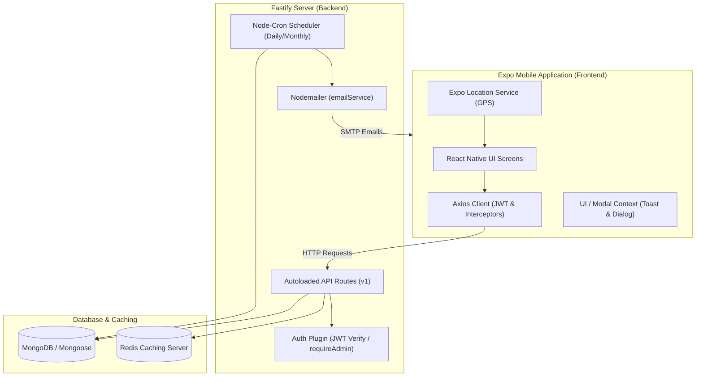
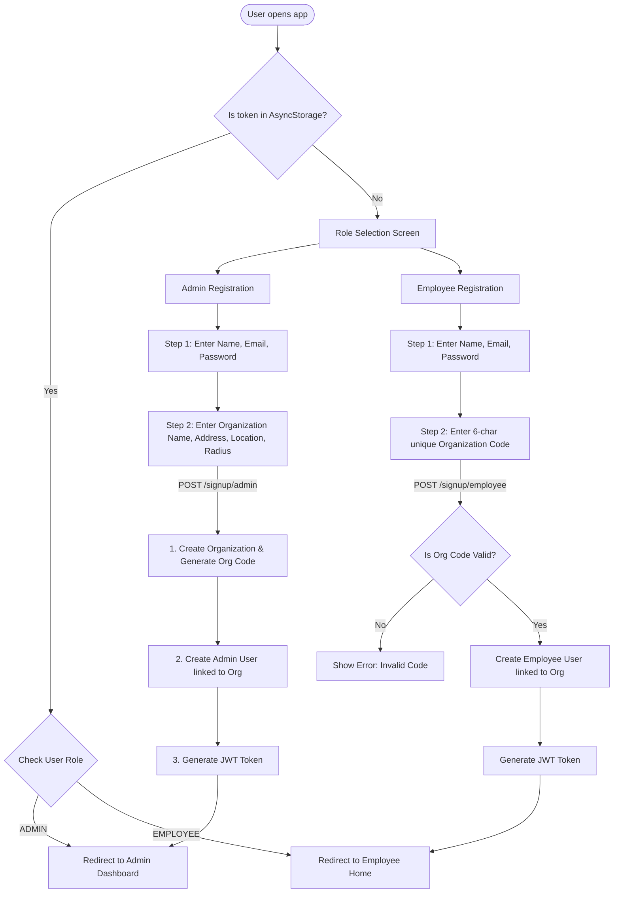
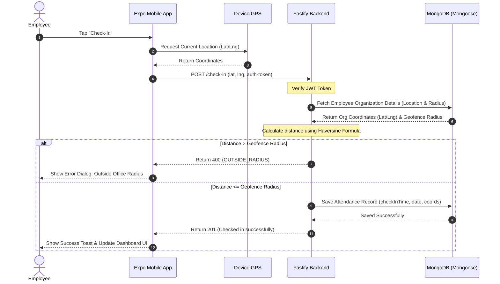
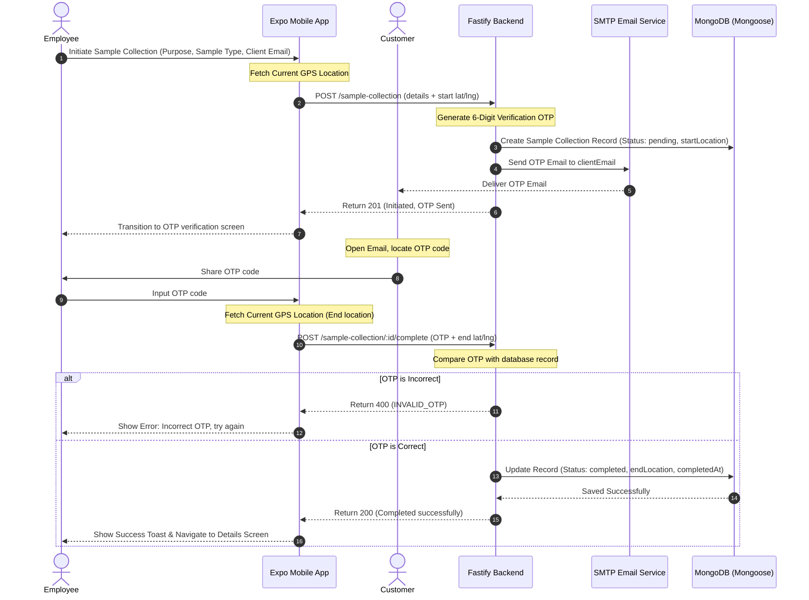
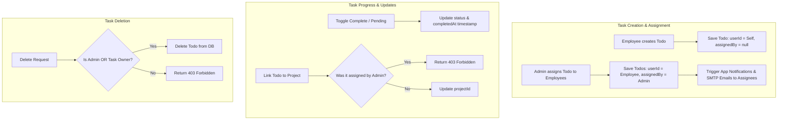

# Employee Attendance, Task, Project & Sample Collection Management System

This project is a comprehensive enterprise solution designed to manage employee workflows, track attendance using GPS geofencing, manage daily tasks, enable collaborative project administration, and facilitate secure sample collections verified via customer OTP.

---

## 🏗️ High-Level System Architecture

The application is structured as a client-server architecture separating the mobile interface from the data-processing backend:



---

## 🛠️ Technology Stack & Setup

### Backend (Fastify API)
- **Runtime Environment:** Node.js & TypeScript
- **Web Framework:** [Fastify](https://www.fastify.io/) — lightweight, highly performant, and structured around modular plugins.
- **Autoloading:** `@fastify/autoload` automatically registers plugins under `/src/plugins` and routes under `/src/routes`.
- **Database Wrapper:** [Mongoose](https://mongoosejs.com/) mapping schema models to **MongoDB**.
- **Authentication:** JWT tokens via `@fastify/jwt` using request decorators (`authenticate`, `requireAdmin`).
- **Caching:** Redis via `@fastify/redis` for rapid key-value caching (exposed as `fastify.cacheClient`).
- **Cron Scheduling:** `node-cron` running asynchronous tasks for generating and emailing reports.
- **Mailing Engine:** `nodemailer` connecting to SMTP with pre-built HTML templates.

### Frontend (Expo Mobile App)
- **Framework:** [Expo SDK 56](https://docs.expo.dev/versions/v56.0.0/) & React Native.
- **Programming Language:** TypeScript.
- **Routing:** File-system based router using `expo-router`.
- **Data Fetching:** `@tanstack/react-query` (React Query) for caching and synchronizing server state, combined with `axios` using request/response interceptors to handle JWT tokens and `401 Unauthorized` responses.
- **Geolocations:** `expo-location` for fetching GPS coordinates (latitude, longitude, and geocoded addresses).
- **Design System:** Custom theme (`src/theme`) specifying unified spacing, Hanken Grotesk and Plus Jakarta Sans typography, and color tokens.

---

## 🗄️ Database Architecture & Data Models

All models are defined as Mongoose Schemas mapped to MongoDB collections:

### 1. `User` Schema
Stores user profiles, access control credentials, settings, and organization membership.
- **name** (`String`, required): Full name of the user.
- **email** (`String`, required, unique): Work email address.
- **phoneNumber** (`String`): Contact phone number.
- **password** (`String`, required): Hashed password using `bcrypt`.
- **role** (`String`, enum: `['EMPLOYEE', 'ADMIN']`): User access role.
- **designation** (`String`): Employee job title (e.g. Sales Executive, Technician).
- **department** (`String`): Employee department (e.g. Operations, Logistics).
- **employeeId** (`String`): Unique company ID tag.
- **organizationId** (`ObjectId`, ref: `Organization`): Linked organization.
- **emailNotificationsEnabled** (`Boolean`, default: `true`): Configurable notification setting.
- **appNotificationsEnabled** (`Boolean`, default: `true`): Configurable notification setting.
- **status** (`String`, enum: `['ACTIVE', 'INACTIVE', 'REMOVED']`, default: `ACTIVE`): Soft-delete indicator.

### 2. `Organization` Schema
Defines company boundaries, security geofencing, and default working hours.
- **name** (`String`, required): Corporate or office branch name.
- **addressName** (`String`): Geocoded address or landmark.
- **location** (`Object`):
  - **latitude** (`Number`): Central office coordinate.
  - **longitude** (`Number`): Central office coordinate.
- **radius** (`Number`, default: `500`): Office geofence radius in meters.
- **workStartTime** (`String`): Expected start time in `HH:MM` format (e.g., `'09:00'`).
- **workEndTime** (`String`): Expected end time in `HH:MM` format.
- **orgCode** (`String`, unique): 6-character unique alphanumeric code used for employee self-onboarding.

### 3. `Attendance` Schema
Records daily employee clock-in and clock-out details.
- **userId** (`ObjectId`, ref: `User`, required): Reference to the employee.
- **date** (`String`, required): Target date format `YYYY-MM-DD`. Indexed with `userId` for uniqueness.
- **checkInTime** (`Date`, required): Date-time stamp when checked in.
- **checkOutTime** (`Date`): Date-time stamp when checked out.
- **latitude** (`Number`, required): Check-in latitude.
- **longitude** (`Number`, required): Check-in longitude.

### 4. `Todo` Schema
Manages tasks assigned to or created by employees.
- **userId** (`ObjectId`, ref: `User`, required): The employee executing the task.
- **task** (`String`, required): Description of the todo item.
- **status** (`String`, enum: `['pending', 'completed']`, default: `pending`): Completion state.
- **date** (`String`, required): Scheduled date format `YYYY-MM-DD`.
- **projectId** (`ObjectId`, ref: `Project`): Optional project mapping.
- **assignedBy** (`ObjectId`, ref: `User`): Set if task was delegated by an Admin or Project Manager.
- **completedAt** (`Date`): Date-time stamp of completion.

### 5. `Project` Schema
Groups team members and tasks under structured deliverables.
- **name** (`String`, required): Project name.
- **description** (`String`): Brief description.
- **organizationId** (`ObjectId`, ref: `Organization`): The organization owning the project.
- **dueDate** (`String`, format `YYYY-MM-DD`): Target deadline.
- **createdBy** (`ObjectId`, ref: `User`): Project creator.
- **members** (`Array<ObjectId>`, ref: `User`): List of employees assigned to collaborate on the project.

### 6. `SampleCollection` Schema
Tracks secure operations where field employees collect physical samples.
- **userId** (`ObjectId`, ref: `User`): Employee conducting the collection.
- **purpose** (`String`): Goal of collection.
- **sampleType** (`String`): Material type.
- **clientEmail** (`String`): Customer email address receiving OTP verification.
- **otp** (`String`): 6-digit numeric verification code.
- **status** (`String`, enum: `['pending', 'completed']`, default: `pending`).
- **startLocation** (`Object`):
  - **latitude**, **longitude** (`Number`): Start GPS coordinate.
  - **address** (`String`): Start location address.
- **endLocation** (`Object`):
  - **latitude**, **longitude** (`Number`): Completion GPS coordinate.
  - **address** (`String`): Completion address.
- **startedAt** (`Date`): Timestamp at start.
- **completedAt** (`Date`): Timestamp at verification success.

### 7. `Notification` Schema
Manages in-app notifications shown to users.
- **userId** (`ObjectId`, ref: `User`): Target recipient.
- **title** (`String`): Notification header.
- **message** (`String`): Detailed alert text.
- **status** (`String`, enum: `['unread', 'read']`, default: `unread`).

---

## 🔄 Core Feature Flows

### 1. User Registration & Onboarding Flow
The app allows users to create accounts based on their designated roles. Admins create organizations, while employees join them using the generated code.



---

### 2. Geofenced Attendance Flow
To prevent clock-in fraud, coordinates fetched from the employee's device are checked against their organization's office coordinates using the **Haversine formula**.



---

### 3. Secure OTP-Based Sample Collection Flow
Field representatives collect samples from clients. The collection is authenticated using an email-delivered OTP to guarantee collection verification.



---

### 4. Collaborative Project Management Flow
Projects coordinate team efforts on deliverables. The system governs creation, access, member additions, and modifications based on role-based access rules.

- **Admin Capabilities:**
  - View all organization projects (`GET /project`).
  - Create and register new projects (`POST /project`).
  - Modify description, title, deadlines, or manage/add project members (`PUT /project/:id`).
  - Delete any project (`DELETE /project/:id`), which triggers a database operation unsetting the `projectId` on all associated employee tasks.
- **Employee Capabilities:**
  - View *only* projects they are added to as members (`GET /project` returns filtered list).
  - Create new projects. Upon creation, the creator is automatically assigned as the project owner/creator (`createdBy`) and added as the first member.
  - Modify metadata or manage team members *only* for projects they created. Projects created by others or by Admins remain read-only.
- **Notifications:**
  - When members are added to a project (either during creation or via updates), the backend fires in-app notifications and sends custom emails via SMTP notifying the invited users.

```mermaid
flowchart TD
    subgraph Creation ["Project Creation"]
        AdminC[Admin creates Project] --> SaveProjA[Save Project under Org ID]
        EmpC[Employee creates Project] --> SaveProjE[Save Project: createdBy = Self, members = [Self]]
    end

    subgraph Access ["Access Boundaries"]
        QueryA[GET /project - Admin] --> ReturnAll[Return all Organization Projects]
        QueryE[GET /project - Employee] --> ReturnMemberOnly[Return Projects where User is in members array]
    end

    subgraph Management ["Project Operations & Rules"]
        EditReq[Edit / Delete Request] --> CheckRole{Is Admin OR Project Creator?}
        CheckRole -- Yes --> UpdateDb[Allow Edit/Delete in DB]
        CheckRole -- No --> Reject403[Return 403 Forbidden]
        
        UpdateDb -- Add New Members --> TriggerNotify[Notify new members: App Notification & SMTP Email]
        UpdateDb -- Delete Project --> UnsetTodos[Unset projectId on all associated Tasks]
    end
```

---

### 5. Task & Todo Workflow
Tasks trace daily deliverables. The system handles task assignment, completion updates, and geofencing/project linking restrictions.

- **Admin Capabilities:**
  - View tasks for any employee in the organization.
  - Create and distribute tasks to multiple employees at once (`POST /todo` with an array of `assignedTo` user IDs).
  - Assigned tasks are linked to the admin (`assignedBy` field).
  - Delete tasks belonging to any employee.
- **Employee Capabilities:**
  - View their own tasks, with filters for **Today**, **Pending**, and **Completed**.
  - Create personal tasks for themselves.
  - Update status (toggle completed/pending). If marked complete, a `completedAt` timestamp is saved.
  - Delete self-created tasks, but cannot delete tasks assigned by an Admin.
- **Collaborative Constraints (Business Rules):**
  - **Project Link Constraint:** If a task was assigned to an employee by an Admin (`assignedBy` is present), the employee is **forbidden** from moving the task to a project (`projectId !== undefined`). This prevents employees from re-allocating delegated admin tasks to unrelated project channels.
- **Notifications:**
  - Assigning a task to someone else triggers automated in-app notifications and SMTP email updates.



---

### 6. Automated Cron Job Report Generation
Automated reports run in the background. The server queries the database, aggregates KPIs, and emails detailed tables to administrators.

```mermaid
flowchart TD
    subgraph DailyCron ["Daily Report Cron (30 11 * * *)"]
        StartD([Daily at 11:30 AM]) --> LoopOrgsD[Loop through Organizations]
        LoopOrgsD --> FetchAdminsD[Get Admins with emailNotificationsEnabled]
        FetchAdminsD --> GetEmpDataD[Fetch Yesterday's Attendance & Todo records for all Employees]
        GetEmpDataD --> CompileD[Compile Daily Records: Name, Status, Clock In/Out, Todo statuses]
        CompileD --> RenderHTMLD[Render Daily HTML Template]
        RenderHTMLD --> SendMailD[Send Email via SMTP to Admin Emails]
        SendMailD --> EndD([Daily Cron Completed])
    end

    subgraph MonthlyCron ["Monthly Report Cron (30 12 1 * *)"]
        StartM([Monthly on 1st at 12:30 PM]) --> LoopOrgsM[Loop through Organizations]
        LoopOrgsM --> FetchAdminsM[Get Admins with emailNotificationsEnabled]
        FetchAdminsM --> GetEmpDataM[Fetch Previous Month's Attendance & Todo records]
        GetEmpDataM --> CompileM[Compile Monthly Records: Attendance Rate, Done/Pending Todo count]
        CompileM --> RenderHTMLM[Render Monthly HTML Template]
        RenderHTMLM --> SendMailM[Send Email via SMTP to Admin Emails]
        SendMailM --> EndM([Monthly Cron Completed])
    end
```



---

## 📂 Project Directory Structure

### 📱 Frontend Application Layout (`emp-app`)
```
emp-app/
├── assets/                     # App icons and welcome illustrations
├── src/
│   ├── api/                    # API endpoints connectors grouped by module
│   │   ├── axios.ts            # Base Axios instance with token interceptors
│   │   ├── auth.ts             # Auth signup and login calls
│   │   ├── attendance.ts       # Check-in, check-out, history, contribution
│   │   ├── todo.ts             # Create, complete, and fetch todos
│   │   ├── project.ts          # Get projects, add members, tasks
│   │   ├── sampleCollection.ts # Initiate and complete sample collection
│   │   └── admin.ts            # Admin stats, reports, employee list
│   ├── app/                    # Expo Router file routing
│   │   ├── (auth)/             # Authentication views
│   │   │   ├── role-selection.tsx
│   │   │   ├── signup-admin.tsx
│   │   │   └── signup-employee.tsx
│   │   ├── (tabs)/             # Employee primary portal
│   │   │   ├── home.tsx        # Dashboard, Clock action, Contribution calendar
│   │   │   ├── tasks.tsx       # Daily to-do list
│   │   │   ├── projects.tsx    # List of projects
│   │   │   ├── profile.tsx     # Settings, Profile metrics
│   │   │   └── sample-collection/ # Sample collection workflows
│   │   ├── (admin)/            # Admin primary portal
│   │   │   ├── dashboard.tsx   # Stat overview, quick lists
│   │   │   ├── employees.tsx   # Employee list, status edits
│   │   │   ├── organization.tsx# Update work times, geofence, address
│   │   │   └── reports.tsx     # Monthly & daily chart analytics
│   │   ├── login.tsx           # Authentication gateway
│   │   └── _layout.tsx         # App wrapper loaded with theme fonts
│   ├── components/             # Reusable UI components
│   │   ├── ContributionGraph.tsx # Attendance GitHub-style graph
│   │   ├── AddTaskModal.tsx    # Modal to register new tasks
│   │   ├── SampleDetailView.tsx # Displays detailed sample data
│   │   └── DatePickerInput.tsx # Custom form date picker
│   ├── context/
│   │   └── UIContext.tsx       # Global Toast and Dialog modal handlers
│   └── theme/                  # Design system parameters
└── package.json
```

### ⚙️ Backend Server Layout (`emp-backend`)
```
emp-backend/
├── src/
│   ├── models/                 # Mongoose schemas (User, Attendance, Org, etc.)
│   ├── plugins/                # Fastify plugins auto-loaded
│   │   ├── db.ts               # Mongoose DB connector hook
│   │   ├── auth.ts             # JWT validators (authenticate, requireAdmin)
│   │   ├── cron.ts             # node-cron scheduled reports scheduler
│   │   ├── redis.ts            # Redis cache registration
│   │   └── reply.ts            # Custom response format decorators (ok, created, badRequest)
│   ├── routes/api/v1/app/      # Autoloaded endpoint routes
│   │   ├── auth/index.ts       # Registration and login logic
│   │   ├── admin/index.ts      # Employee CRUD, reports compilation, stats
│   │   ├── attendance/index.ts # Check-in / check-out geofencing, history
│   │   ├── todo/index.ts       # Task management, delegator notifications
│   │   ├── project/index.ts    # Collaborative project setup, member invites
│   │   ├── sample-collection/  # Initiate sample collection, OTP verification
│   │   └── user/index.ts       # Profile fetch/update, password change
│   ├── services/
│   │   └── emailService.ts     # Nodemailer email sender hook
│   ├── utils/
│   │   └── emailTemplates.ts   # HTML email templates (Reports, OTP, Assignments)
│   ├── app.ts                  # Autoload and server initializations
│   └── driver.ts               # App startup port listener
├── .env                        # Configuration (Mongo URL, SMTP auth, JWT secret)
└── package.json
```

---

## 📡 API Endpoints Reference

All routes require a header: `Authorization: Bearer <JWT_TOKEN>`. Exceptions are standard auth endpoints (Login/Signup).

| Endpoint | Method | Role | Description |
| :--- | :--- | :--- | :--- |
| `/api/v1/app/auth/login` | `POST` | Public | Login credentials, returns token, user info, organization detail. |
| `/api/v1/app/auth/signup/admin` | `POST` | Public | Registers admin, creates organization, generates `orgCode`. |
| `/api/v1/app/auth/signup/employee` | `POST` | Public | Registers employee and links to organization using `orgCode`. |
| `/api/v1/app/attendance/check-in` | `POST` | Employee | Checks in. Validates geofence coordinates against organization center. |
| `/api/v1/app/attendance/check-out`| `POST` | Employee | Checks out of office, completes attendance record. |
| `/api/v1/app/attendance/contribution`| `GET` | Employee | Fetches attendance dates for a target month & year (for Contribution graph). |
| `/api/v1/app/attendance/stats` | `GET` | Employee | Computes weekly working hours and punctuality percentages. |
| `/api/v1/app/todo` | `POST` | All | Adds one or more tasks. Emails notifications if assigned to other users. |
| `/api/v1/app/todo/:id` | `PATCH`| Employee | Changes todo status. Employees cannot re-assign tasks set by Admins. |
| `/api/v1/app/todo` | `GET` | Employee | Paginated list of tasks filtered by `today`, `pending`, or `completed`. |
| `/api/v1/app/project` | `POST` | All | Creates project. Invites members and sends in-app & email notifications. |
| `/api/v1/app/project/:id` | `GET` | All | Returns project metadata along with linked tasks. |
| `/api/v1/app/project/:id` | `PUT` | Creator/Admin| Updates project name, details, due date, and manages member list. |
| `/api/v1/app/sample-collection` | `POST` | Employee | Starts sample collection, generates OTP, sends it to client email. |
| `/api/v1/app/sample-collection/:id/complete` | `POST` | Employee | Verifies OTP and completes sample collection with end GPS locations. |
| `/api/v1/app/admin/employees` | `GET` | Admin | Fetches list of active/removed employees and joins check-in states. |
| `/api/v1/app/admin/employee/:id` | `GET` | Admin | Details on employee (recent attendance, tasks, sample collections). |
| `/api/v1/app/admin/stats` | `GET` | Admin | Computes present/absent summary for the active workspace. |
| `/api/v1/app/admin/reports` | `GET` | Admin | Aggregates daily reports (30 days) and monthly reports (6 months). |
| `/api/v1/app/admin/organization`| `PUT` | Admin | Modifies organization name, address, geofence, coordinates, work hours. |

---

## 🚀 Setting Up the Project Locally

### 1. Prerequisites
Ensure you have the following installed on your machine:
- **Node.js** (v18 or higher recommended)
- **MongoDB** (Running on port 27017 or remote Atlas cluster)
- **Redis** (Running locally on port 6379, password configured if needed)
- **Yarn** or **NPM**
- **Expo Go** app (on iOS/Android device) or emulator configured.

### 2. Setting Up the Backend
1. Navigate to the backend directory:
   ```bash
   cd emp-backend
   ```
2. Install dependencies:
   ```bash
   yarn install
   ```
3. Configure the `.env` file in the root of the backend folder:
   ```env
   DATABASE_URL=mongodb://localhost:27017/emp-db
   REDIS_HOST=127.0.0.1
   REDIS_PORT=6379
   REDIS_PASSWORD=mypassword
   JWT_SECRET=mysupersecret
   SMTP_USER="info.cluix@gmail.com"
   SMTP_PASS=svfm dhaf yjmg rbco
   SMTP_FROM="info.cluix@gmail.com"
   ```
4. Start the Fastify server in development mode:
   ```bash
   yarn dev
   ```
   The backend will be running at `http://localhost:3000`.

### 3. Setting Up the Frontend
1. Navigate to the frontend directory:
   ```bash
   cd emp-app
   ```
2. Install dependencies:
   ```bash
   npm install
   ```
3. (Optional) Configure environment variables. By default, the app points to `http://localhost:3000/api/v1`. If testing on a physical device, set your machine's local IP address:
   ```env
   EXPO_PUBLIC_API_URL=http://<YOUR_LOCAL_IP>:3000/api/v1
   ```
4. Start the Expo development server:
   - For Android emulator/device:
     ```bash
     npx expo run:android
     ```
   - For general Expo dev tool:
     ```bash
     npx expo start
     ```
5. Scan the QR code with your Expo Go app or start on your device/emulator.
